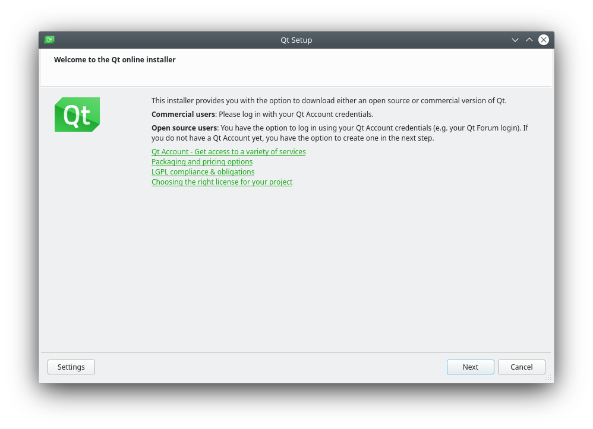
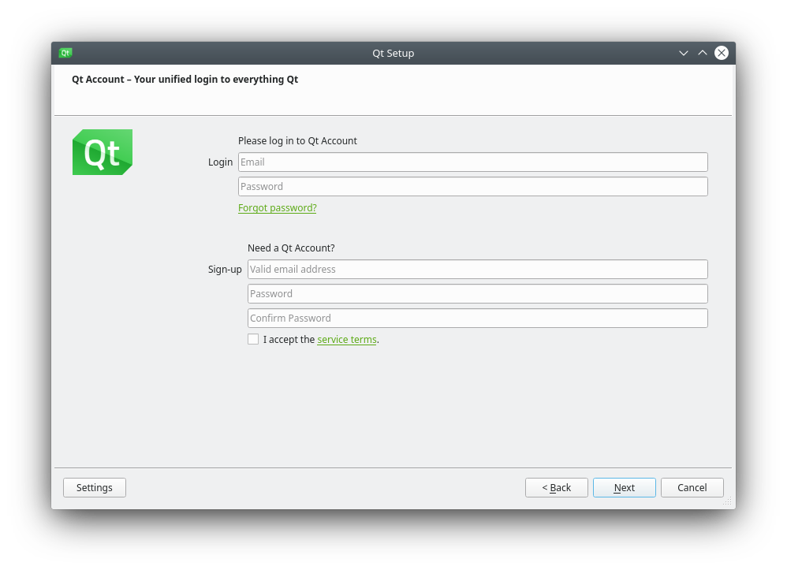
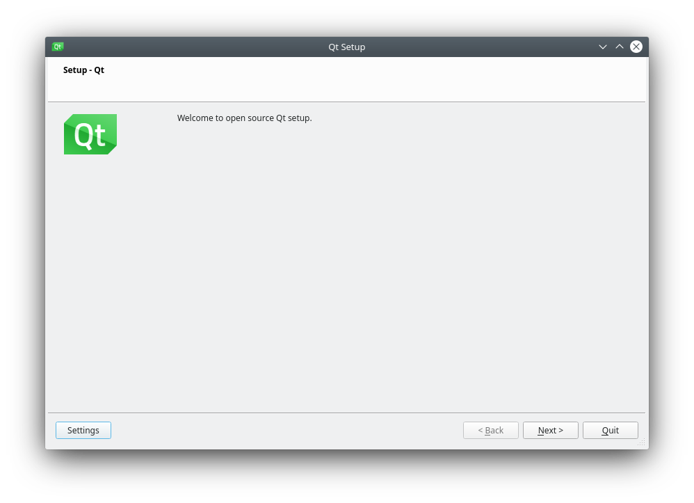
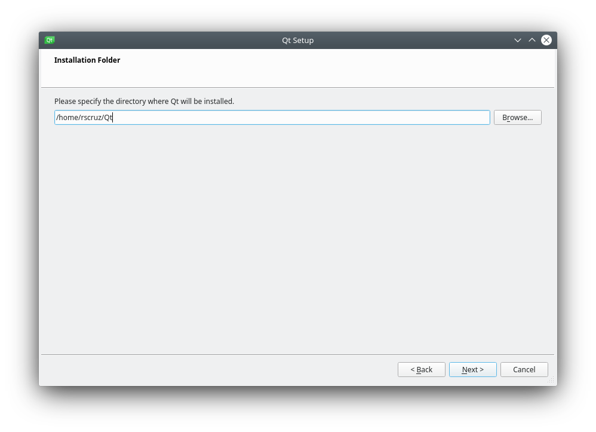
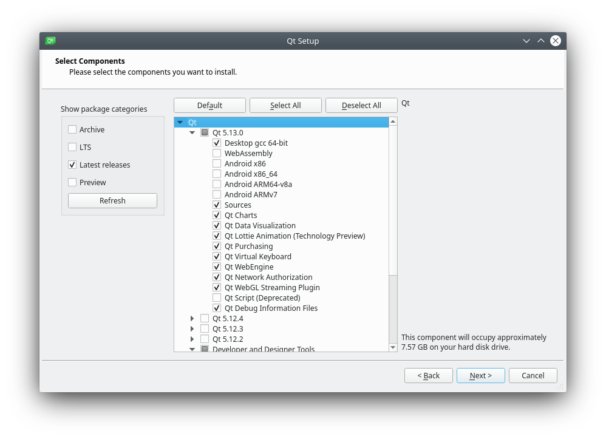
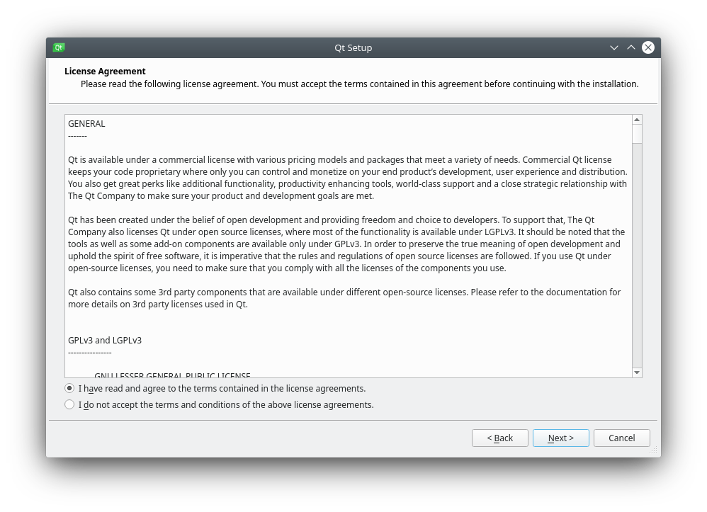
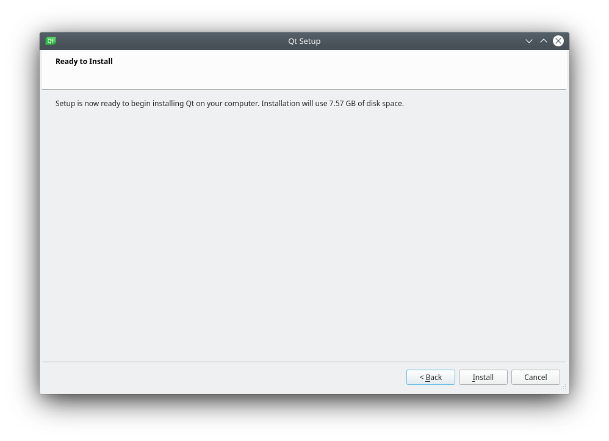
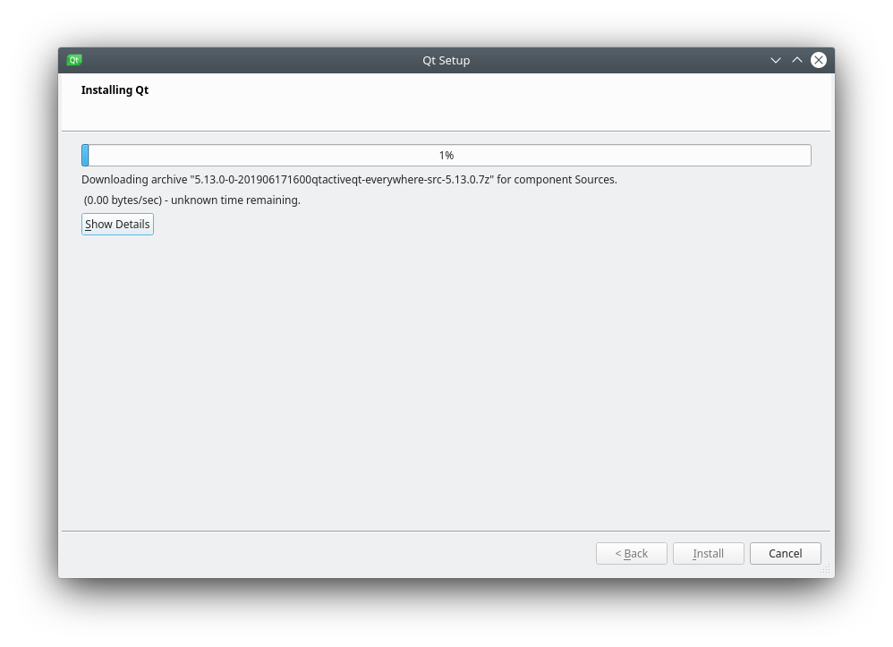
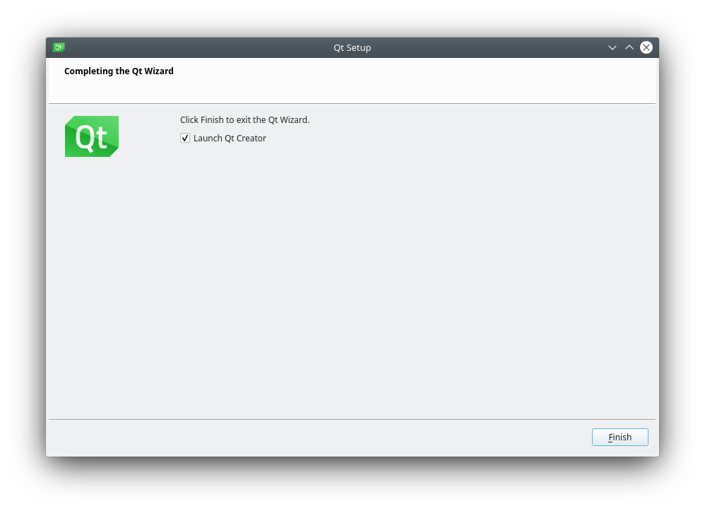
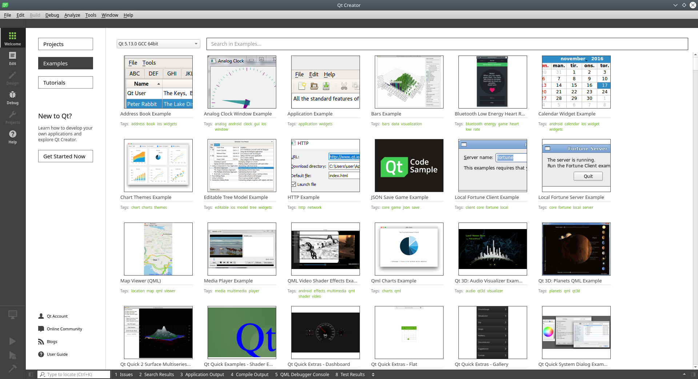

# Qt Creator

Qt Creator é uma IDE (Ambiente Integrado de Desenvolvimento) multiplataforma.

Comparado ao Qt Designer o Qt Creator é uma ferramenta muito mais completa, visto que ela vai muito além da prototipagem da interface.

Enquanto o Qt Desginer trabalha somente com interfaces em XML o Qt Creator nos permite utilizar também o Qt Quick, que no lugar do XML utiliza QML.


    
O Qt creator possui basicamente 2 versão:

- Commercial: Versão paga da IDE.
- Open Source: Versão gratuita da IDE.

A diferença entre os recursos pode ser vista da própria [página de download](https://www.qt.io/download).

## Instalação

> O procedimento de instalação é indêntico para todos os sistema operacionais, a unica variação é o formato do instalador.

No caso de sistemas Linux é baixado um instalador do tipo `run`, para executá-lo basta dar permissão de execução:

```bash
sudo chmod +x NomeDoAquivo.run
```

E executar o instalador com o comando:

```bash
./NomeDoArquivo.run
```

Com isso o instalador do Qt Creator é iniciado.

Na tela que é exibida podemos clicar em **Settings** para configurar o proxy ou mesmo os repositórios, caso não haja a necessidade de realizar essas configurações clique em **Next**:


Agora podemos fazer login com uma conta Qt já existente, podemos criar uma nova conta ou simplesmente ignorar essa etapa clicando em **Skip**:



Após fazer login (ou não) os repositório serão atualizados e será exibida a tela de boas vindas do instalador, clique em **Next**:



Agora é possível escolher o local onde o Qt Creator será instalado, após definir o local clique em **Next**



Agora podemos selecionar a versão do Qt e os pacotes que serão instaldos, após selecionar os pacotes necessários ao seu projeto clique em **Next**:



Termos (licença) de uso do Qt, caso esteja de acordo clique em **Next**:



O instalar exibe o espaço em disco que será necessário:



Agora é inciado o download e instalação dos pacotes necessários:

instalado com sucesso

Aguarde até o final da instalação e clique em **Finish**:



Qt Creator em execução:


