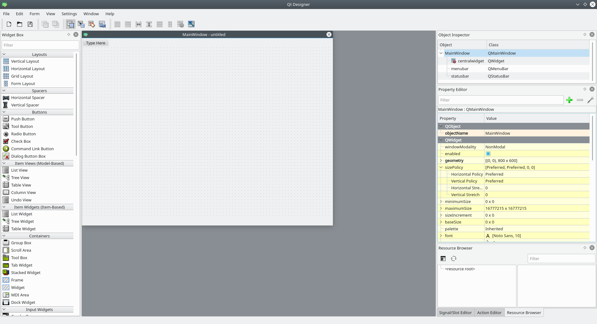

# Qt Designer

O Qt Designer é uma ferramenta que permite projetar e construir interfaces gráficas de forma visual (WYSIWYG).



Os arquivos gerados pelo Qt Designer possuem a extensão ``*.ui`` e seu conteúdo é do tipo ``XML``.

> XML, do inglês eXtensible Markup Language, é uma linguagem de marcação recomendada pela W3C para a criação de documentos com dados organizados hierarquicamente.

Os 3 tipos de janelas que podem ser construídas com o Qt Designer estão:

- **Widget**: Tipo mais simples de janela.
- **MainWindows**: Este tipo de janela herda da janela do tipo Widget e nela podemos ter barra de menus e barra de status.
- **Dialog**: Janela utilizada para interações com o usuário (alertas, inputs, decisões, etc).

## Instalação 

### Ubuntu

```bash
sudo apt install qttools5-dev
```

### Fedora

```bash
sudo dnf install qt5-qttools qt5-designer
```

### Windows

Acesse o site [fman build system](https://build-system.fman.io/qt-designer-download) (https://build-system.fman.io/qt-designer-download) e realize o download do instalador.

### macOS

Acesse o site [fman build system](https://build-system.fman.io/qt-designer-download) (https://build-system.fman.io/qt-designer-download) e realize o download do instalador.